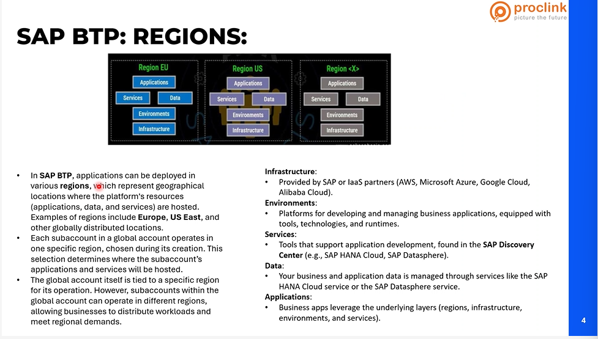
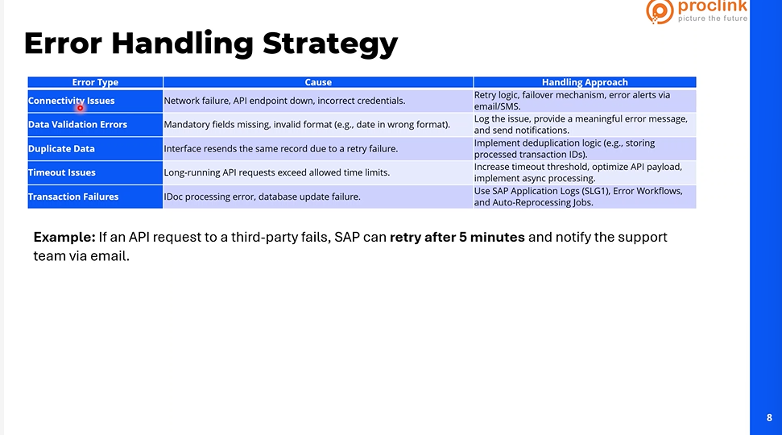

CAP
Intergration suite

# ERP:

FEATURES:

1. integration--combining business functions
2. Automation--reduces manual tasks.
3. Data analysis---how is my inventory looking like?
   how reports, acording to that cjanges will be there

4. scalability:adding features, adapts to bussiness growth

# Why business need ERP:

higher productivity

deeper reusults:
give quickr essults
accerelarying reporting:
jit reports, what is my total balance, investements, cash resource etc'
lower risk:standard quality checks all should be done, and preserved in sys,
this will help for lower risk.  
simpler IT:
improved agility:adapatable to new things,

# Popular Erp products:

SAP
ORACLE ERP CLOUD
MIcrsoft Dynamics 365
netsuite
workday
jd edwards
SAGE

# why sap is popular:

1. comprhensive functionality:
   finance, quality manaagment, all these mdules are avaialable.
   whatver functionality are needed, those modules are needed.
   SAP is from germany,
   extended coverage.
2. scalability:
   small or medium customer, they can simply go for public cloud.
   that is GROW.(IT IS SAAS)
   cloud provider, per user basics, they need to pay for SAP.
   only application security is needed.
3. Global presence:
   it is used by 1000 of people
4. customisation:
   dng according to customer requirements.
5. deployment option: cloud(rise and grow) and on-premise
6. Innovation: ai, ml and iot.
   sap zole ---->like copoloit. (Assistance)
7. support ecosystem: sap having partner programs, they partner with sap, they will hve developemnet network, comparing to other products

# ADVANTAGES OF SAP OVER OTHER ERP PRODUCTS:

1.

order to cash:
stock to order

car:
make to order

manufacture to order.

1. real time processing : SAP hana's in-memory database.
2. industry-specofc solutions
   consumer customer

manufacturer customer

IT companies also use SAP.

there process would be diff.
sap as diff processors in it.

3. integration:
   intergrate on cloud, on prem

4. data security
5. global support is there 24/7
   p1,p2 support
   consulting service

6. advance analytics:
   descion driven reporting
   sap analytics

7. continous innovation:

8. proven track record:

fiori framwork, like html application.

# sap evolution

1. foundation phase:(1972-1980)
   SAP R/1 (1973)
   r/2
   r/3(1992)-client server architecture era
   (out dated)
   2010--->
   sap hana
   sap s/4 hana
   cloud expansion

sap rise: (2021):(cloud provider)
who ever want to use s4 hana, they haveto have high avaialabitlty
, lot of infrastrututer, lot of dependencies, severs, costly maintinalibity,

we can now start setting up sap enviroment on cloud, which as azure. aws,pay as u go model.
we dont need to invest, operational chargers

sap grow(2023):
ecc: u have own infra , platform, installed, creating own service that is sap with customisations, it invovles adminstartion to integration , security and lot more things,

rise is all about having as a cloud.

# grow:( we take care of configrations)

is software as product, like gmail ( )
they have emilinated platform set up thing,
but they have limitations.

# SAP ARCHITECTURE:

MVC ( VIEW IS NODE JS)
(MODEL IS DATA MODEL), CONTROLLER--->SERVICE

PIPO===>CLUD VERSION (CPI)( SAP, BTP SUITE )
rise and grow

# SAP MODULES:

WHY WE NEED TO K ABOUT MODULES

DIFF GUYS INVOVLED ARE:
sap architect
functional: functionality fo the prdouct
functional consultant, who have good idea on
after analysis,

1. finance:
   all transactions should be recorded.

2. Controlling:

3. Materail management :

track the inventory, and raw materials, planning processes.

eg: ingredeients and packaging materails,
raw materials, branding paper,
procurement: in sys, do we have all raw materials, do we have stock?

4. sales and distribution(out bown delivery, we will sent to warehouse, pack it, ship it and invoice is sent, ):
   sales team talks to customer,
   handle sales order processing,
   pricing
   billing,

   edi(eelectronice data integrteation) format.

5. production planning:
   how do i plan my production.
   check if stock is there,
   capacity planing(what is demand planning)

6. quality management:
   after producing the product, someone as to test,

7. plant maintanence:

8. human capital management:

9. project system:
   planning, execution
   budjets

10. logistics execution:
    tranporation

11. warehouse management:

stock management
picking and packing kind of things,

3pl partner.

12. extended warehouse managemnet:

: for advacnce operations

13. customer service:
    repairs,

14. suuplier relationship managemnet(like business partner)

15. supply chain management

16. crm

plm

# SAP saas products:

SAP S/4 HANA CLOUD:
SAP SUCCESSFACTORS: FOR RECRUITMENT
SAP ARIBA:TO DEAL WITH SUPPLIERS
SAP CONCUR: BIG ORGANISATION, ALL TRAVELLING, REBUIRSEMNT ALL THIS ARE INTEGRATED, TO IT

SAP FIELDGLASS:
SAP CUSTOMER EXPERIENC:

SAP IBP( FOR PP MODULE)

SAP SAC
SAP BUSINESS BYDESIGN
SAP DWC()
SAP

SF, ARIBA, FEILDGLASS WE EXPECT.

# TECHNICAL TEAMS INVOVLED & R &r

GREEN FEILD IMPLEMENTATION:FROM STRATCH

FROM ON PREM TO GROW OR RISE( THIS I CALLED BROWN )
BROWN FEILD :TARGET DIREcT

blue feild implementation:(selective )
carry(data and customisations)

Iif it is rise:

1. bsaics:
   all admisnstration

2. developemnet team: using asab

3. functional: gathering business requirements
   configurations:---> as per business process.

4. securting:granting permisiions
   role bases acesss control

5. data migrataion:

data migration cockpit is prrsent.

tranfsering data to legacy to sap

6. integration team:
   buildin interface for data excange
   develop integration on ecc, rise etc.

7. testing team:
   technical team will have more intreaction with testing team
   conducting perfomance testing.
   see if there are any defects.

8. change management teams:
   this comes when we go to releases.

fiori--> f.e
abap, cap--be
functional--->testing

# key customer stakeholders

who is what??

1. executive sponsor:

2. business process owners:

eg:jucie:
finace
procure
sales and distribution
productoion

4 diff processes are there>

they will represnt these.

3. end users:
   handling agents,order prcoessing agents,
   finance: controllers, promos
   reconsalitions, ar(acc receivables), ap(acc payables)

4. IT manager/Director:

5. Funtional leads

6. data owners:
   thse guys will help to guide

7. change maagment lead:

8. compliance and audit teams: quality checks, kind of thngs.
9. finance stakeholders: controllers,

10. steering commiteee: senior executives

# SAP ACTIVATE METHODOLOGY

what phases will we have duirng implememntation

1. discover:if we wants to implement,
   understand the business goals, get info, what we want to achieve. current process. workshops, they will send the

they will come up with solution.

functional team.

2. prepare:
   project goals, assemble the team, which team is required what,
   set up
   rise: infra. basis team and lot of discussions,

3. explore:
   conduct workshops to get detailed requirements,

fit to standard analysis

4. realise:

finace func team will talk to organisers, then talk to technical

when come to integrtion team ,

from design, dev (FUT )
sit,
uit,

to test.

5. deploy:

6. run:

sap rise and grow:

mdeium adnd small business are trying to use grow.

sap methodology
non sap--> watferall, agile,

sap we do end to end
sap ams , then devops come into picture

risef w
rise and grow,

day :4
fit to standard gap analysis:
ricefw
tr process

# fit to standard gap analysis:

need to understand every detail

1.
2.
3. what is future expansion plan
   produce, finished goods based on orders,

def: it is af reamework, the business process understand and try to undertand the sap.

# key steps:

process review:
fit assessment:
gap identifaction:
solution design:
to see if we can configure, extensuin or devlop

product vs project.

input:
business requirements.
output: this is what is gng to fit . that will align the sa[ standard functionalties. ]

- gap

# benefits1:

cost effiencey:
faster implementation

# challenges:

process changes
complex gaps

# solution:

configuration
extensions
custom development

these alll will happen in explore phase>

technical team will get the requirements in realise phase.

functioonl tem will come up with RICEFW:

# SAP RICEFW

1. REPORTS: sales, finance reports, stadards need to be customise,
2. interface:
3. coversions:
   data migrations
4. enchancements: BADI tool:
   we do validations.
   embedd a custom features/fields.
5. forms:
   to send emails, invoice forms,

adobe form services within sap, for priniting.

6: workflows: how should work happen, managing tasks.

# TR PROCESS IN SAP AND SAP BTP.

tr: transport process:
if anything related t ricef, sap configratiosn, those are moved to transports.

purpose:
s/4 hana is grow

raise a t4 in s4 , whihc is give a number,
for deploying,to move to qa.
tms: embedded system whihc have dev, qa, product

helps: have the locks, and displcned way of moving the things.

# rise vs grow

SAP RISE: 50-65% IN ECC
35% ON S4 HANA, ON PREM, AZURE

SAP GROW:
public cloud,

why sap rise:
ure on ecc and there are lot of customisations, (sap forms,( now fiori app), idocs, to achive functionality. )
ecc to s4 hana(private/public) is challenge.

1. support
2. get rid of data cost
3. avaialbilty to diastater management is more optmised.

when:

grow:
do comparitively fast than rise,

rise have more options.

rise infra: taken care by cloud provider
same by grow.

when comes to paas:
rise , s/w hasto be brought.

set up takes more time.
grow:
it is an saas, no need to buy s/w

everything is done in grow.

per user bases grow can be used, for small companies. '
small process are there.

everything is a service.

# key features:

cloud erp:
grow:
green feield implementation cloud.

automation and ai: for both sap btp is used.

# deployement:

we dont have to control more

# cost model:

grow: scope based. ()

# scalabitliy:

rise:
for large:

grow:
small to mid sizedbusines

# integration:

grow: through apis:
rise: apis, idoc,

focus area:
rise: allowed to do customisations, not to make like ecc again,
grow: public cloud:

implementation time:
rise:
more time.

grow: read to use, 10-7 days.

support and maintainance:

both rise and grow together:
in large entrispire: each business unit,
when a company as ecc, and aquired a new entity, which can work indepemendtly, for that we can use sap grow,

grow is for small to medium customers.

these versions
sap ecc
sap s4/ hana on prem
sap /rise
sap grow

# projects being executed in sap:

cloud transformation:
adding sap btp to it,

digital trans:
ur changing pattern,
useing ai.

data migration:
hand in hand with implememtation

grc module for sap sustainabality projects.

# COMMUNICATION SYSTEM: EXTERNAL SYSTEMS.

a url for exhanging communication., where we can peform crud operations.

we need api's.

1. communication user:

user type :
basic auth
it could be oauth2.0
security certifacte.

examples:

in sap grow, sales order(api)
it is odata api.

ask admin for communication secanior, then they wll give end piont url.

communication arragemnet:

combination of for inbound.

# sales distribution

some transaction codes: VA03
fiori app.
to search through the things like

display sales orders.
outbound delivery change
display billing documents

how sales order looks like?

payment terms:

sales order header and sales order items are there.

sales header:

# outbound delivery change

outbound delivery: assisgned to set of folks sitting in warehouse,
they will pick and pack and shipping.

Outbound Delivery: A customer orders 200 smartphones from your company. You create an outbound delivery, pick and pack the items, and ship them to the customer.

Inbound Delivery: Your company orders 1000 batteries from a supplier. When the shipment arrives, you create an inbound delivery to receive and inspect the goods before updating inventory.

all these things can be seen in document flow.

rise:--> s4 hana on private
grow---> s4 hana on public

day :

# sap btp overview:

before btp:
we have
s4 on prem or ecc:
reports means business warehouse.

need to work with 3-4 teams for getting report.

it is technology complexity, .

forms , workflows within sap,

sap is comeup with unified cloudbased platform:
they will give infrastructure, we have to give services.

1. cloud version of pipo is btp integration suite.
2. set of foundationa servives:
   where we can
   developement(): we need a id , host an applicatipn
   automate, : robotic path
   integration(connect diff )
   data anayltics:

3. it can connect to hybrid or cloud
   sap btp with public s/4 hana.

   # key pillars of SAP BTP:

LOW CODE-NO CODE: we can achive business functionality withoutu writing code is no code.

pro code tooling:
sap build code, using this, we can create new app on cloud app pgming model usig python, java , node js ,

digital experience:

devops:

# AUTOMATION:

workflow:
on prem, custom workflows

robotic process automation:
robot agent will do it
on behalf of us.
but we hvae do to configurations.

process monitoring:
anaylise the process

automated document processing:

# integration:

pipo + cloud--> hybrid integration

# DATa and anlytics:

# ai:

sap zole similar to copolit
create chatbot agents, prepare some trained ai model.

abap, rap, cap--->b.e
fiori: fiori authentication. for F.E

# sap btp commercial models

brand new customer or existingcustomer can use free tier.

cloud platform enterprise agreement(cpea):
what we have to do in next 1yr , lot of analysis, takes place.

# subscription mode:

# SAP BTP COCKPIT:

SAP BTP ABAP environment:

RAP--> WILL GO TO

develop a ful stack rap application following the sap btp developers guide.

sap btp, cloud foundry runtime.
sap integration suite.

global acc is given to only few.
in global acc:

resource providers:
boosters: quick step up thing like eg: setup s4 hana cloud adminstration tools.

get started with sap build code.:

create rap or cap applications
system landscapes: when we wnt to integrate with
entitlements:
u get it based on credits in cpea.

cloud floudry--->

html5 applications:

what exactly is rap application
how do we get more credits?
why to create another sub acc?
how is cloud foundry related to subacc which is created.
what is space quota?

why to create instances?
|
|

service to get the service keys.

# sap btp cockpit:

access is given to global adminstrator.

# sap btp architechture:

directory:

entitlement:

it will show what is avaialble in global acc

subaccount:
independent within subacc.

# sap brp:regions

what is clud foundry enviroment.

in global acc, the directory is created,
in that subaccounts are created. is created,
we do this, to say that all are related to production for eg.

to keep everything in systematic way.

what is quota?

# sap btp: environments:

kyma environment:

devlop service that is having micro serrvices like mvc, all apps are micro servuce based.

abap environment:
sap hana publc cloud, have restrictions,
side by side extensions using abap environment

cap or integration suite---> cloud foundry
which have micro servce architec---> kyma
when we want to create be, like rap.--->abap environment

# services in sap btp

# sap discovery center.

# capablities:

graph: it is a service, where we can connect with multiple apis.
we get the unified url.

trading partner management:

odataprovisioning:

open connectors: lot of connectors in integration suite,

integration assessment:

migration assessment: pipo, fesalibity analyssis, if the particular thing is possible or not.

# sap build code:

cloud foundry spaces is for deployement.

low code to no code.

cloud version of vs code --->sap business application studio.

build code is for cap application and rap also abap cloud..
it has genai.(joule)

# sap hana cloud:

in memory dtabase.

we can use this hana cloud, outside the sap also as a db.

# FIT TO STANDARD GAP ANALYSIS:

# sap interface liefcycle:

design:
( 1st will define the intergration type.
do u have apis do u supoort oauth2.0?
data mapping: what is my source to data mappining
error handling:
do i need to send the logs to
)

1. functional requirements
2. best practices

build: develop sap pgms, idoc or spec?
abap need to devlop idoc.
middleware configruations--> login , email

error handling: validation checks, do i need to send email notifications
is it recoverable or not.

testing: perform unit testing, get ft, prepare td, start devloping if, include error handlimg, then unit testinf then functional testing, then security checeks are also done.

# interface design phase:

real time: jit(within scepnds it shuld reache target system. )
the data flowing simultanelously when sending from source to target.

batch: the middleware jobs runs , every 10 min.

# integration patterns:

how do we do integration
eg:

finance has given the
sap to b1 integration.

api based integration: for real time manner, only thing is there could be some possibilty of security. '

middleware-based(esb):
we dont use in inetgration suite.

event-driver arcguitechture: it is popular.
it is like, like real time plug in plug out, reualsibility,

aysynchronous process, it is complex,

file based integration:
data is exchanged through test files,
error handling is not so easy,

sftp connection is too slow, or the files are open we cannot open it,

# interface build phase:

here we do develop.

# error handling strategy:

connectivity issue:
for eg our target is bank, and the api is not wprking,
for this we should have retry option.
if primary is not working, then try using secondary thing.
duplicate data.

# interface testing approach:

sap admin imports the tr to qa.

# best practices for interface desgin and devlopement:

custome coded means--> power shells,

day :14:

# integration suite:

integration suite: it is a paas, we dont need to worry about infra like vmware.

it is giving pplatfform,

it has 2 integration:
data,
process.

sap to sap-->ec2 to public/private
or grow to ricef object.
sending payment infor to bank, from bank to sap.
sap to non sap.

cloud services.
third-party: bank
non sap: event broker, .net, java

it has real time capabilty and batch( run for every 10 min.
)

# why integration suite:

we have lot of middeware.

where ever sap is aavailable it goes very well.

cloud native:
it is auto scabalbe.

pre-built integartions:
security and coplainace: there is more security.

event -driven architecture:
whoch ever customer want accordingly it will give.

hybrid integration capability
:
we can use this on prem, we can integrate pipo.

# prerequiisties to set up integration suite:

mulsoft, azure integration are dff like integration suite.

admin willl do quick checks.( they will do prerequisits)

what is my intergation strategy.
hwo should i build
should i do it through sap to non sap
or sap to sap.

connectivity:
do i need to connect with api proxy or other things
all guidance is given.

# capabilities of sap btp integration suite:

ci:process based using adaptors like connectors( we will give confirgations what is host url)
api managament:
where we can configure api proxys for integruition suite .
why api proxys:

open connectors:it as pre built connectors, for third party applications.
maily we will use it with salesforce.

event mesh:
two level messaging:

synchrinous:
source will req or handover the info to taget and wait for response.
asychronous: it will not wait for response.

integration advsior:b2b scenarios.

edge intergation cell: some customers, they will not keep some info in cloud, so they do keep in on prem .
so to connect with on prem with clpud we will edge integration.

trading partner mananagement:
from sap same info to multiple customers:(for oubound)
this is framekwork whcih as customer profile, what kind of inboud and outbound connections,
they have set of pre flowed iflow's.

sap graph:
ideally need to connect to sf api, grow api,
it is complex,
so we will go through graph
, only one api.

odata provisioning:
replaciing net weaver gateway.

integration assessment:
inbuilt feature.
design checks.
develop ur strategy.

migration assessment: migrate from pipo to this

move from legacy to

# benefits of sap btp integration suite.

flexibility:
on ecc,
sap s4 hana on prem
cloud entities, sap, non sap , saas,
all these will talk to sap btp integration suite.

lowcode/ no-code:

integrtaion. suite is more process related.

reduced tco(total cost of ownership): tco, it depends,

security and compliance: it supports dual key,

basic, oauth, in api.

event-driven architecture:
with event mesh, data processing is done.

after opening integration suite:

1. step
   : manage capabilties.

discover:

integrations,
pre packaged.

apis

what is coupa?

# day:15

in monitor:

security material:

# license models:

# use cases :

ibp-->saas application

each customer will have there own interface name.

what are artifacts:
we can create value mapping( source one name, is mapped to other name in target.),
apis:
imported archives:
message mapping:
functional libraries:
integration flow:
integration adapter:
script collection:
data type:
message type:

in design:
graph:
b2b scenaoris
custom type systems:
for soap req kind of work.
standard integration for prepackaged.
customer---> desgin
test--> apis to test, it gives framkeworkf for test
configure---> provider specofcic,

monitor--> monitor if's, pgp keys, maintain access policies.

able to connect---> using test connectivity.

# day:16

ctms service process for import and export intergration flows.

# cloud integration features:

features:

artifacts: we have a;; integration flow, mapping etc.
integration flow:
mapping: for interface we have source and target, it can be sap or non sap.
we are handling message or data for particular run.
we can convertS according to what target wants.  
we can concat data, according to what target wants.

value mapping: we will do certain mapping which should be configurable.
what values can be fit in.
eg:replacing values within systems(source and target)
its like key value.

we can make quick adaptions.

integration adapter:pre built I.fLOWS
api artifacts:
we can directly use this artifact when custom

script collection:
we keep all groovy scripts and can be reused.

data type: in message transformation,
it can be reused on directly used in particular flow.

imported archives:

message type:
we can create an artifact and we can reuse it.

# additional features in sap cloud integration:

integration flow is a combination of sender adaptor and reciver adaptor(target)

these all are pallot options.( messaga maping, subprocess etc)

# data transformation & mapping features:

